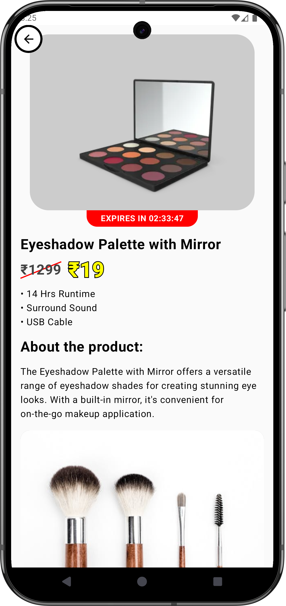

# 🛍️ Product Detail App

Welcome to the **Product Detail App**, a modern Android application built using **Jetpack Compose**. This app features a visually appealing **splash screen** with animated falling blue lines, followed by a **detailed product screen** displaying product information, pricing, features, and additional images. It uses **Retrofit** to fetch product data from a dummy API and offers a smooth, responsive experience.

---

## ✨ Features

- 🔵 **Dynamic Splash Screen**: Captivating splash screen with falling blue lines in various shades, fading out after 2 seconds.
- 🛍️ **Product Detail Screen**: Displays product name, original and discounted prices, runtime, features, and description.
- 🌐 **API Integration**: Fetches real-time product data using Retrofit from [`https://dummyjson.com/`](https://dummyjson.com/).
- 🎞️ **Smooth Transitions**: Fade-out animation for the splash screen, with a seamless white status bar and black icons.
- 📱 **Responsive Design**: Scrollable layout to ensure all content and buttons are accessible on any screen size.
- ⏱️ **Countdown Timer**: Red banner showing a live countdown for limited-time offers.

---

## 📷 Screenshots

### Logo

> The Profile App logo, showcasing a minimalist design with a focus on user profiles.

### Splash Screen and Profile Screen

  
  

  

> The splash screen with animated falling lines (left) transitions to the profile screen (right), displaying user data and rewards.

---

## 🎥 Demo Video

> 📹 A quick demo of the Profile App, highlighting the splash screen animation and profile screen navigation.

[▶️ Watch Demo Video on Google Drive](https://drive.google.com/file/d/1h5DuBT1wLWgZDartQjNoEf8bkhenx7G0/view?usp=sharing)

---

## 📦 Download

Download the latest APK here:

[Download APK](./apk.apk)

---

## 🧑‍💻 Usage

- **Splash Screen**: Displays on app launch with animated falling lines and fades out after 2 seconds.
- **Product Detail Screen**:
  - Shows product image, name, original & discounted price, runtime.
  - Includes countdown timer for deals.
  - Displays product features, additional images, and a detailed description.
  - Action Buttons: **ADD TO CART** and **BUY NOW**.

- **Scroll to Explore**:
  - View detailed product description.
  - Extra features like:
    - ✅ Genuine Products
    - ⏳ Limited Time Deals
    - 🚚 Free Shipping
    - 🔒 Secure Payments

---

## 🗂 Project Structure

All functionality is organized within a single Kotlin file:

| Section              | Description                                                                 |
|----------------------|-----------------------------------------------------------------------------|
| `MainActivity.kt`    | Contains all app logic, including:                                          |
|                      | - SplashScreen composable with animated falling blue lines                  |
|                      | - ProductDetailScreen composable showing scrollable product data            |
|                      | - Countdown timer implementation for limited-time offers                    |
|                      | - Retrofit setup to fetch data from the dummy API                           |
|                      | - `Product` and `ProductDisplay` data classes for API and UI mapping        |
|                      | - Navigation and transitions between splash and product detail screens      |

---

